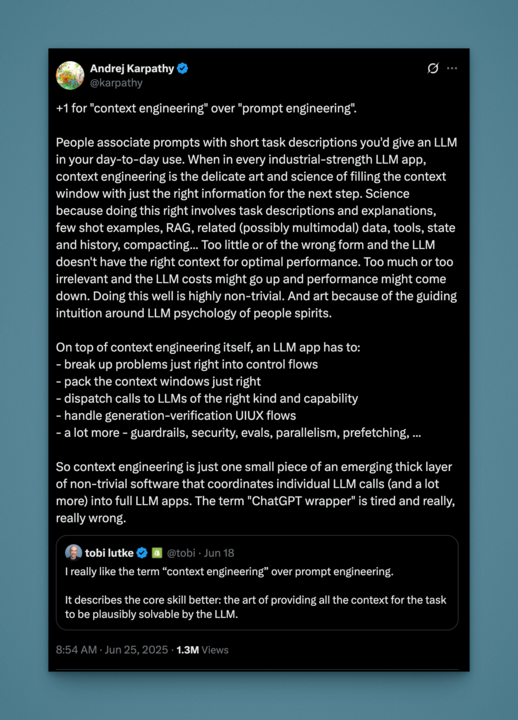
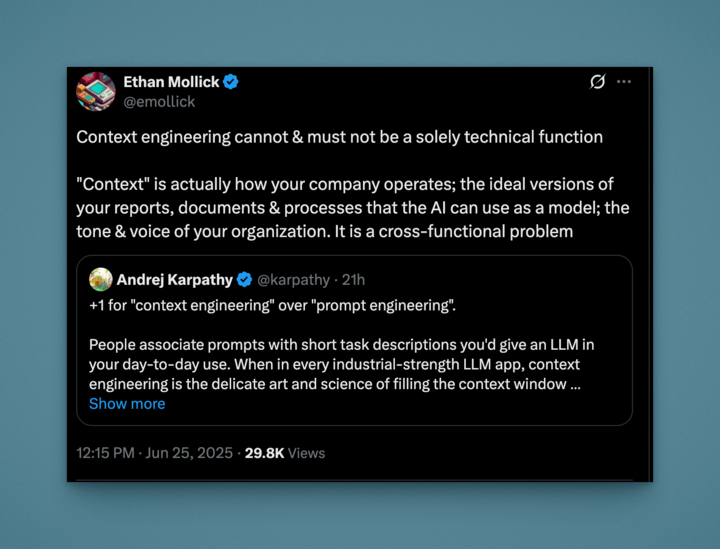

# ai-demo
Basic AI demo using OpenAI API with Node.js

# Installed Dependencies

```bash
npm i ai @ai-sdk/openai @ai-sdk/openai-compatible zod dotenv
npm i -D @types/node ts-node typescript
```

# Create a .env file

```bash
OPENAI_API_KEY=your_api_key # from https://platform.openai.com/api-keys
```

# Run the script

```bash
npm run exec
```

# Building with LLM APIs Guide

## Modules

- Module 1: Basic Text Generation
- Module 2: Streaming Text
- Module 3: Summarizing Text
- Module 4: Chat with a Model
- Module 5: Structured Outputs with Zod
- Module 6: Extracting Data from PDFs
- Module 7: Using Local LLMs
- Module 8: Vector/Embedding Search

### Food for thought




## Popular LLM API Providers

- **OpenAI**: ChatGPT, GPT-4, function calling
- **Anthropic**: Claude models with long context
- **Google**: Gemini Pro series
- **Mistral**, **Cohere**, and open models via **Hugging Face**

---

## Why Use the Vercel AI SDK?

The [Vercel AI SDK](https://ai-sdk.dev/) provides a unified, developer-friendly interface for interacting with multiple LLM providers. Instead of learning each provider's unique API, you can write code once and easily swap between models from OpenAI, Anthropic, Google, and others. This abstraction simplifies experimentation, reduces vendor lock-in, and enables features like streaming, structured outputs, and local LLM support with minimal code changes.

**Alternatives:**  
Other popular frameworks for working with LLMs include [LangChain](https://www.langchain.com/) and [LangGraph](https://langgraph.readthedocs.io/), which offer more extensive orchestration, chaining, and agent capabilities. These may be preferable for complex workflows, but the Vercel AI SDK is often simpler for rapid prototyping and direct model access.


# References

- [ai-sdk](https://ai-sdk.dev/)
- [Matt Pocock's AI SDK](https://www.aihero.dev/vercel-ai-sdk-tutorial)
- [Vercel AI SDK Masterclass: From Fundamentals to Deep Research](https://www.youtube.com/watch?v=kDlqpN1JyIw)
- 